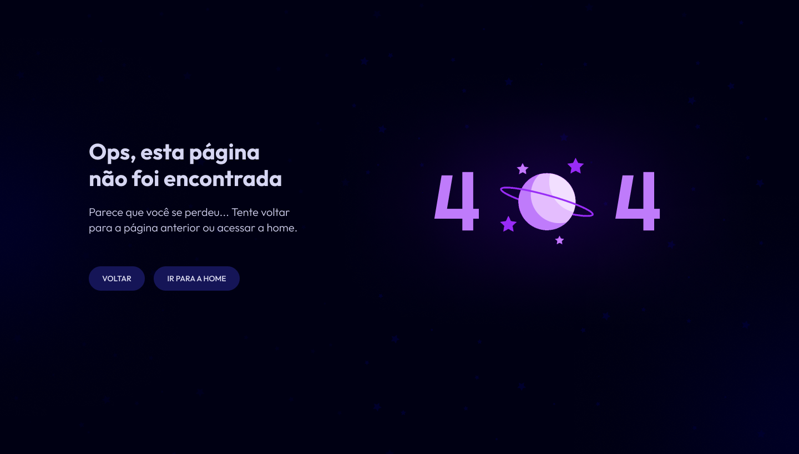

  

## 🖥️ Projeto

Esta uma página web simples para exemplicar uma página de error 404

## 🚀 Tecnologias

Para que este projeto fosse possível foram utilizadas as seguintes tecnologias durante o desafio semanal #boracodar da Rocketseat

- HTML
- CSS
- Git e Github

## 🏷️ Layout

Você pode visualizar o layout do projeto através
[deste link](https://www.figma.com/file/5Wr2hruUrb6fs1Hgjwphhc/P%C3%A1gina-404-%E2%80%A2-Desafio-27-(Community)?type=design&node-id=3-811&mode=design&t=59g8p3Q774ovNwtL-0).
É necessário ter uma conta no [Figma](https://www.figma.com)